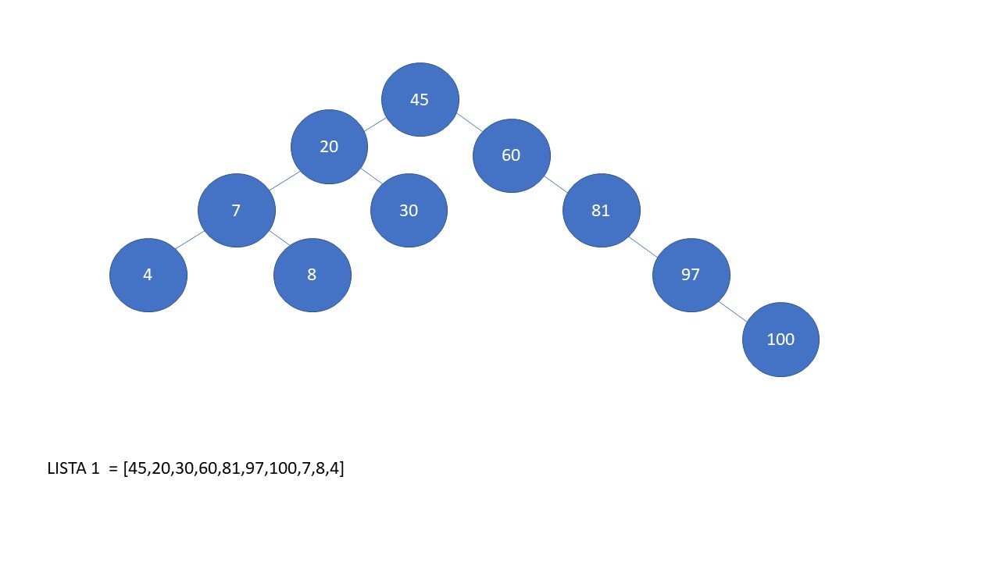
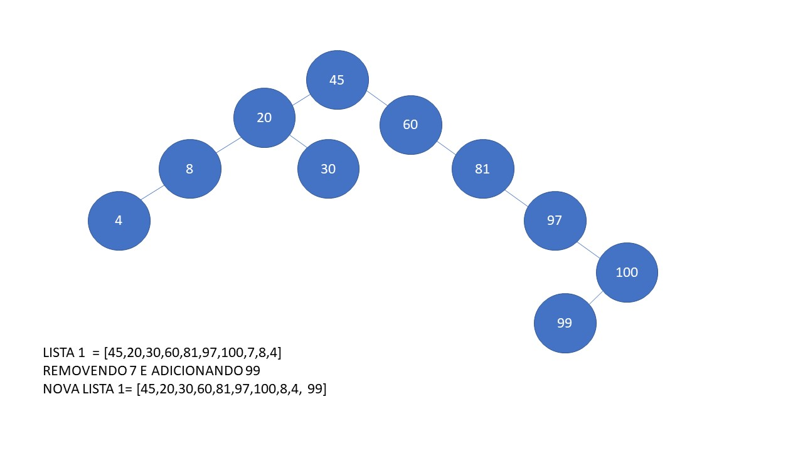
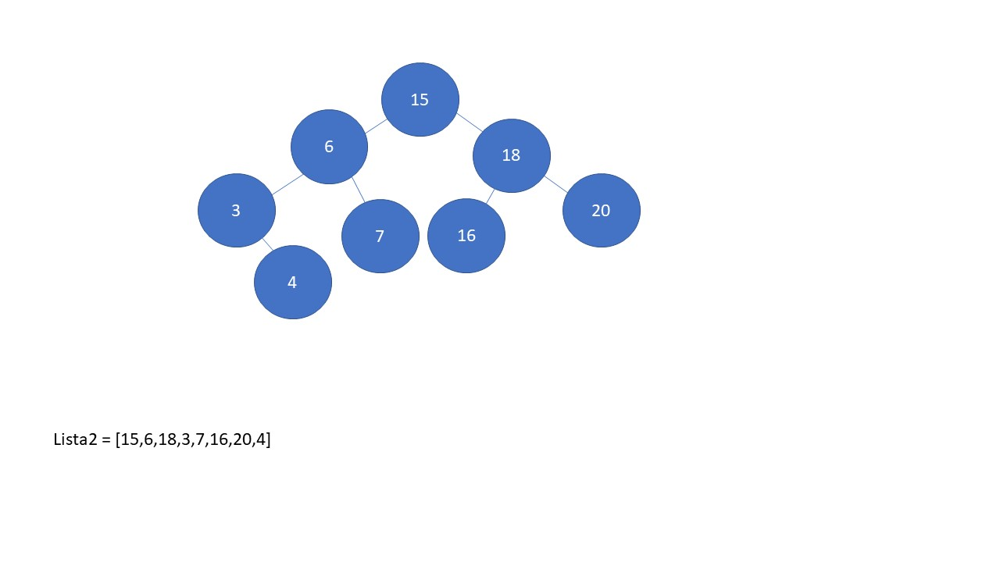
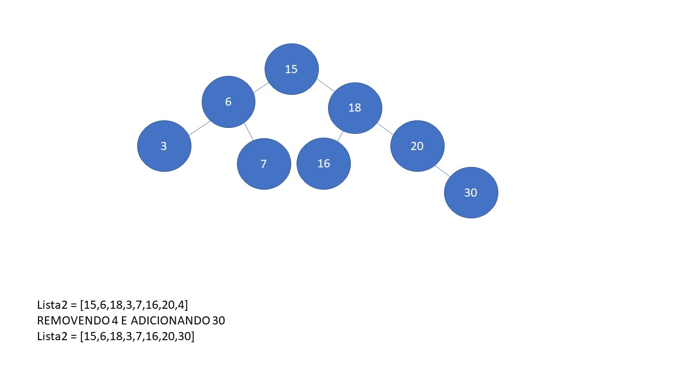

Crie uma árvore para cada lista abaixo, adicione um valor nela e remova outro, mas, em pelo menos uma das árvores, a remoção deve ser de um nó com dois filhos.

Lista1 = 45,20,30,60,81,97,100,7,8,4

REMOVENDO 7 E ADICIONANDO 99 NOVA LISTA 1= 45,20,30,60,81,97,100,8,4, 99

Lista2 = 15,6,18,3,7,16,20,4

REMOVENDO 4 E ADICIONANDO 30 Lista2 = 15,6,18,3,7,16,20,30

